<p align="center">
  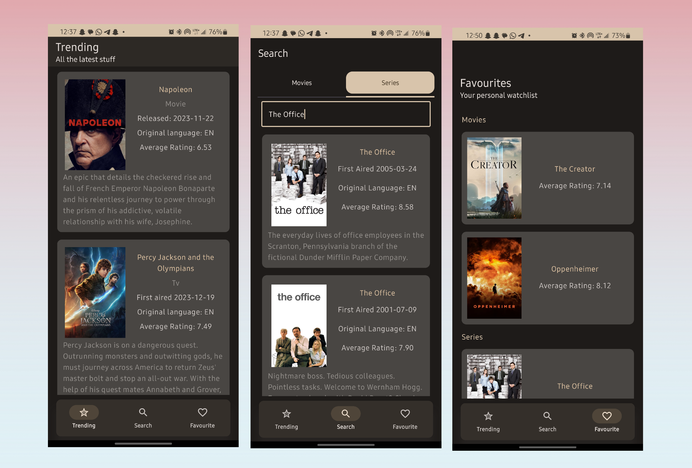
</p>

<p align="center">
  <a href="https://appetize.io/app/b_o7lwpntvmwbohd7yhp2wfde45e?device=pixel7&osVersion=15.0&scale=75"
     target="_blank"
     rel="nofollow noopener noreferrer"
     aria-label="Live Demo">
    <strong><u>Live Demo 🚀</u></strong>
  </a>
</p>

---

# 🎬 Watchlist

**Watchlist** is a movie and TV series database application that helps users discover trending content, search for specific titles, and create a personalized watchlist.

Create your very own watchlist today.

---

## 📌 Project Description

Watchlist is an **Android application** that leverages the **TMDB API** to provide access to an ever-growing database of over **2 million movies and TV series**.

Key highlights:

* Efficient **paginated search**
* **Favourites management**
* Visually pleasing UI built with **Jetpack Compose**
* Fully aligned with **Material 3 Design principles**

---

## 📸 Screenshots

### Onboarding

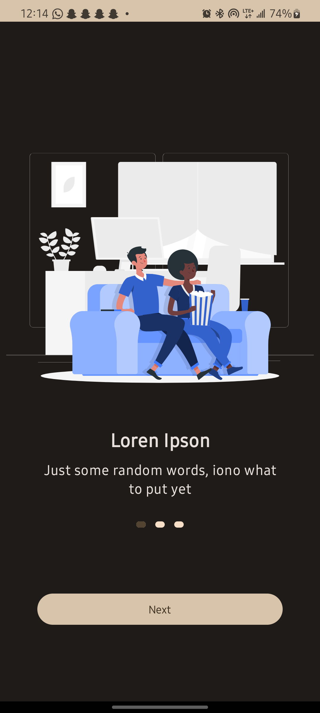
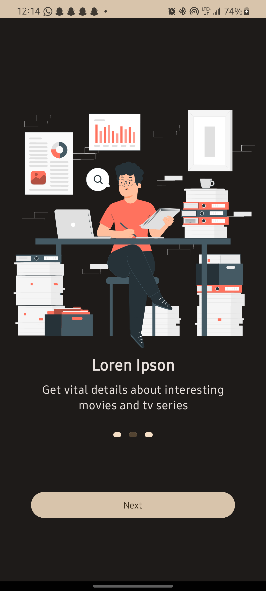
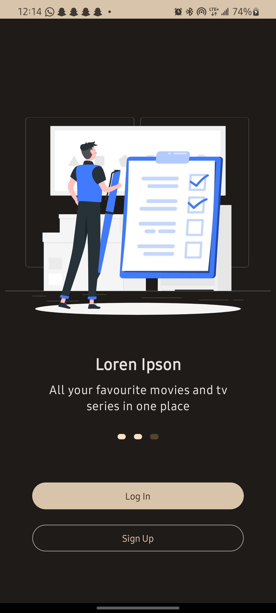

---

### Log In & Sign Up

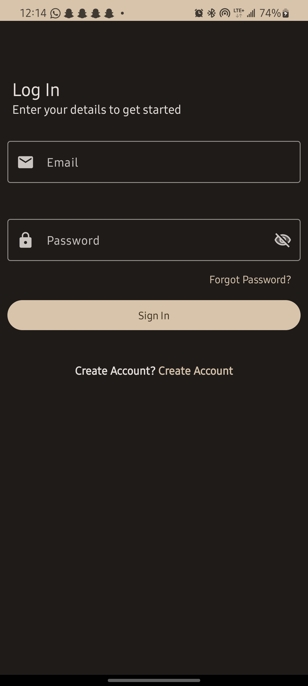
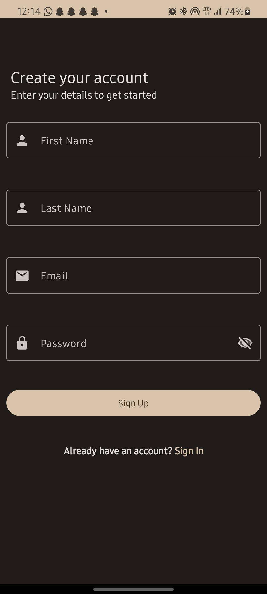
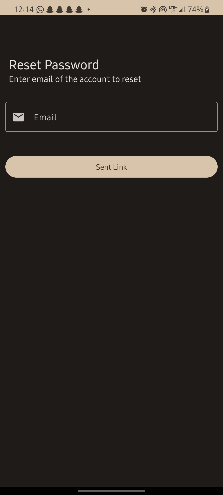

---

### Trending, Search & Favourites

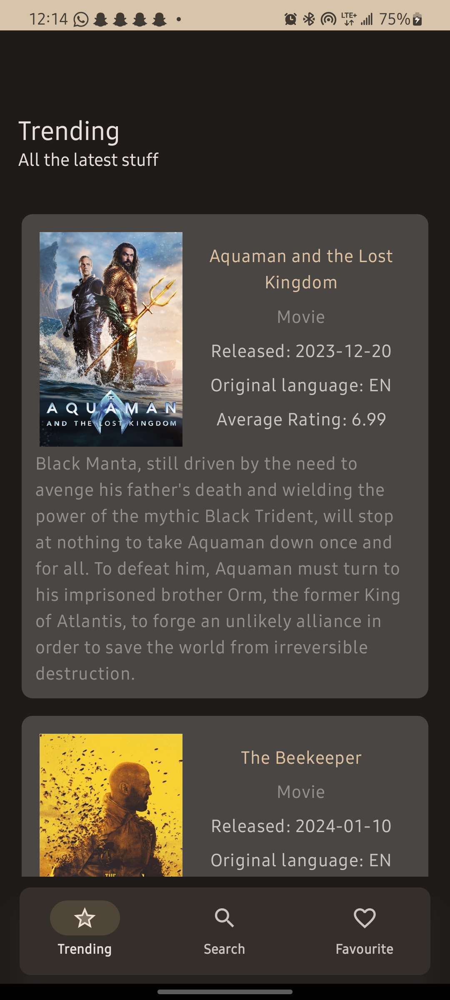
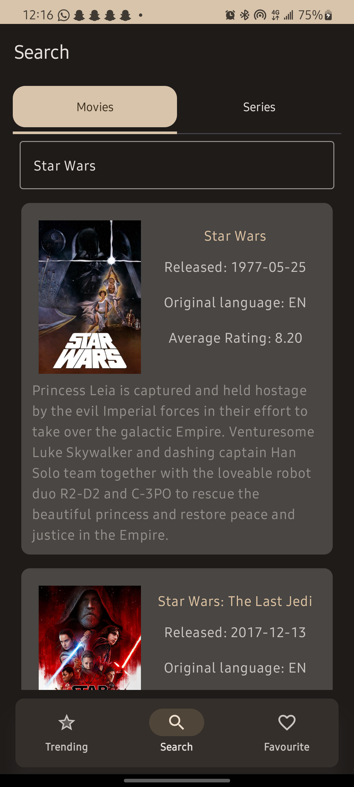
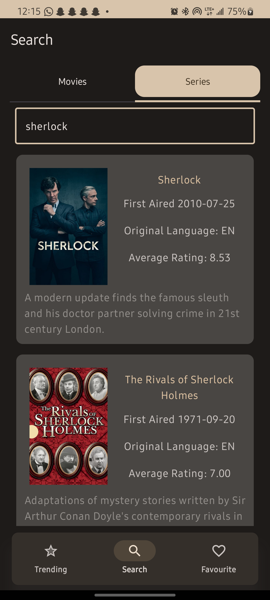
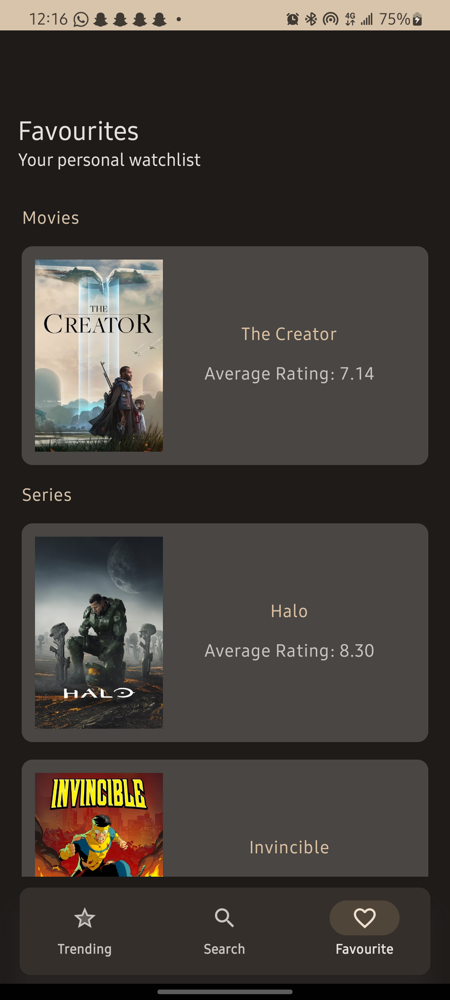

---

### Movie & Series Details

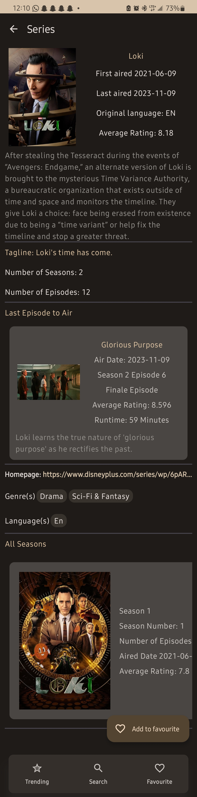
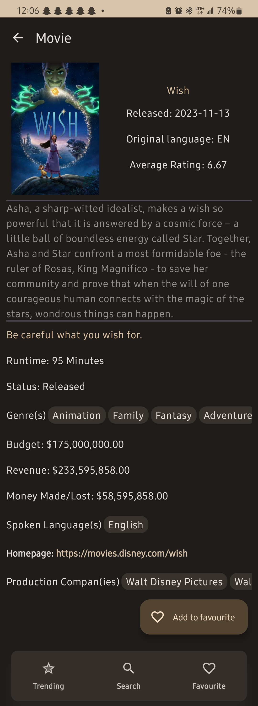

---

## 🛠️ Technologies Used

* Jetpack Compose
* TMDB API
* Retrofit
* Firebase
* Dagger-Hilt
* Material 3 Design

---

## 🧠 Challenges Overcome

Firebase is excellent—but it comes with a few limitations:

1. **Data Object Storage**
   Firebase does not allow storing document values directly as data objects, so document values were stored as JSON instead.

2. **Updating Documents**
   Firebase does not support adding an entry directly to a document.
   The workaround involved:

   * Fetching the document as a `HashMap`
   * Updating the map
   * Writing the updated map back

   This resulted in **two network calls instead of one**, both when adding and removing favourites.

My first instinct was to **over-engineer the entire solution** 😅
I even shared my thought process in a <a href="https://x.com/FemiOkedeyi/status/1753339199724351837?s=09" target="_blank" rel="nofollow noopener noreferrer"> <u>Thread on X</u> </a>.
Feel free to check it out—and don’t forget to like and follow ☺️

---

## 🚀 Future Improvements

* Add **navigation animations** from the favourites screen to detail screens
* Replace Firebase with a **custom backend** to reduce favourites updates to a single network call
* Fetch additional data such as:

  * Cast & credits
  * Video trailers
  * Ratings and reviews

---

## ⚙️ Before You Run

### 🔑 Setting the TMDB API Key

1. Get an API key from <a href="https://developer.themoviedb.org/docs/getting-started" target="_blank" rel="nofollow noopener noreferrer"> <u>TMDB’s Website</u> </a>

2. In the project root, create a file named:

   ```text
   apikey.properties
   ```

3. Add your API key:

   ```properties
   TMDB_API_KEY="xxxxxxxxxxxxxxxxxxxxxxxxxxxxxxxx"
   ```

---

### 🔐 Handling Keystore Properties

You have **two options**:

#### ✅ Option 1 — Release Build Variant

1. In Android Studio, create a keystore via
   **Build > Generate Signed Bundle / APK**
2. In the project root, create:

   ```text
   keystore.properties
   ```
3. Add the following:

   ```properties
   KEY_ALIAS=xxxx
   KEY_PASSWORD=xxxxxxxx
   STORE_PASSWORD=xxxxxxxx
   STORE_FILE=../xxxx/xxxx.jks
   ```

---

#### 🧪 Option 2 — Debug Build Only

If you prefer to skip signing:

1. In the module’s `build.gradle`, comment out:

   ```kotlin
   val keystorePropertiesFile: File = rootProject.file("keystore.properties")
   val keystoreProperties = Properties()
   keystoreProperties.load(FileInputStream(keystorePropertiesFile))
   ```

2. Also comment out:

   ```kotlin
   signingConfigs {
       create("release") {
           keyAlias = keystoreProperties.getProperty("KEY_ALIAS")
           keyPassword = keystoreProperties.getProperty("KEY_PASSWORD")
           storePassword = keystoreProperties.getProperty("STORE_PASSWORD")
           storeFile = file(keystoreProperties.getProperty("STORE_FILE"))
       }
   }
   ```

3. And:

   ```kotlin
   buildTypes {
       release {
           isMinifyEnabled = false
           proguardFiles(
               getDefaultProguardFile("proguard-android-optimize.txt"),
               "proguard-rules.pro"
           )
           signingConfig = signingConfigs.getByName("release")
       }
   }
   ```

4. Ensure the **build variant** is set to **debug** in Android Studio.

---

## 📄 License

This project is licensed under the **Apache License**.
See the [LICENSE](LICENSE) file for details.

---

If you want, I can also:

* Add **badges** (Android, Kotlin, Compose, TMDB)
* Reduce image sizes for faster GitHub loading
* Rewrite this as a **portfolio-optimized project README** for recruiters
